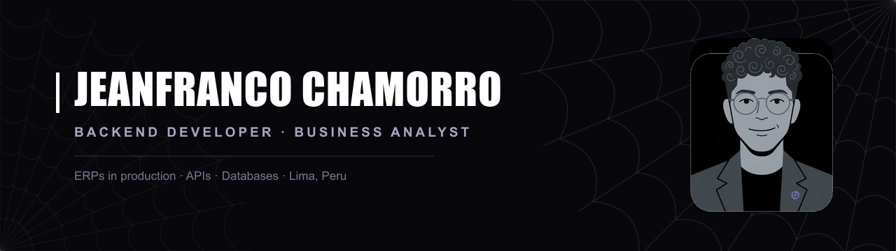

<!--
  GITHUB PROFILE · Jeanfranco Chamorro
  Copy BOTH files into github.com/jeanfrancochamorro2006-jpg/jeanfrancochamorro2006-jpg
    · this file, renamed to README.md
    · banner.png (from public/banner.png in the portfolio repo)

  Before publishing, confirm the portfolio URL below actually resolves.
-->

  
  
  
  

I build ERP systems that run real businesses. The work starts before the
code: understanding the process, gathering requirements and designing the
solution that fits it.

---

## What I do

- **Business systems** — ERPs covering inventory, sales, operations and delivery logistics
- **Backend and APIs** — REST services, business logic and database design
- **Process analysis** — requirements gathering, documentation and automation

---

## Selected work

| Project | What it solves | Stack |
| --- | --- | --- |
| **ELESS · ERP** | Inventory, sales and operations for nationwide manufacturing and distribution of professional beauty equipment | Private |
| **GetUp · ERP** | Orders, personalised nutrition plans and delivery logistics for a healthy food service | Private |
| [**Taste Perú Tours**](https://www.tasteperutours.com/) | Culinary tourism platform: 12+ experiences, filters, online booking and multilingual content | Next.js · Laravel · PHP |
| [**Digital Editions**](https://digital-editions.com/) | Academic EPUB store: 500+ titles, instant download and an in-house payment gateway | Next.js · Laravel · PHP |
| [**Olympus Center**](https://olympus-center.vercel.app) | PC hardware store: catalogue, product pages and checkout | Next.js · Java · Spring Boot |
| [**HARVIS**](https://github.com/jeanfrancochamorro2006-jpg/jarvis-ai) | Spanish-language voice assistant for Windows with neural speech output | Python · Groq · Edge-TTS |

More, including live sites, on the [portfolio](https://portafolio-jeanfranco-ecru.vercel.app).

---

## Stack

**Backend**

**Frontend · Data · Infrastructure**

Also working with **SQL Server** and deploying on my own **VPS (Hetzner)**.

---

Open to backend and full-stack roles, and to freelance projects.
Reach me at [jeanfrancochamorro2006@gmail.com](mailto:jeanfrancochamorro2006@gmail.com)
or on [WhatsApp](https://wa.me/51946087675).
